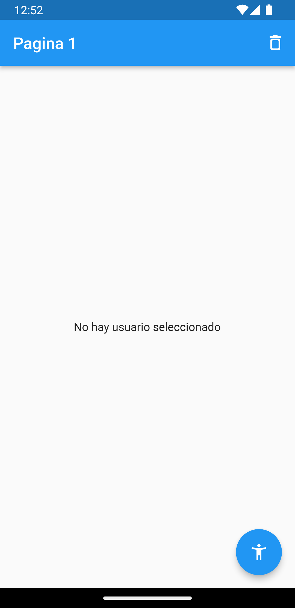
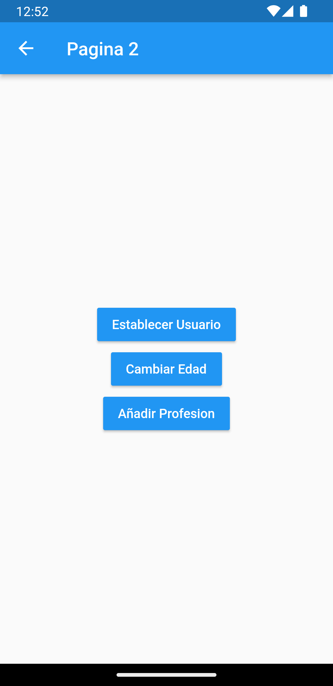
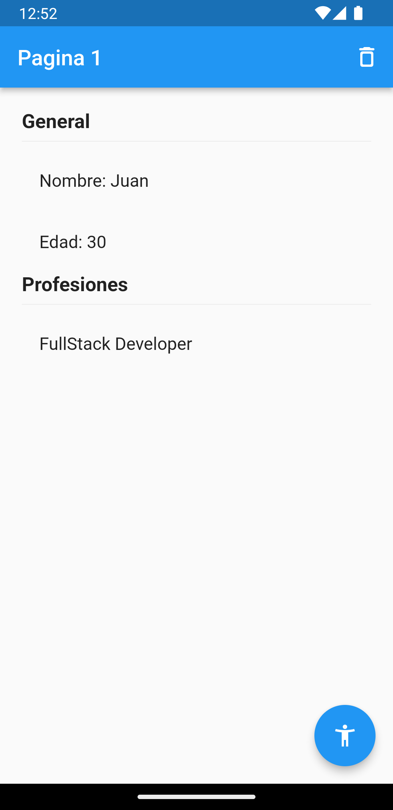
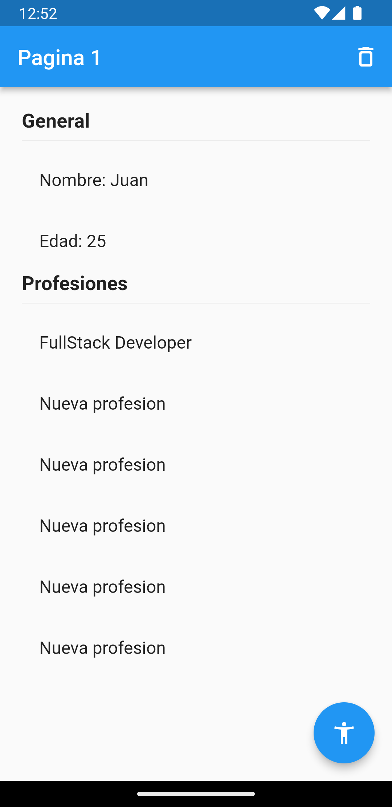

# Flutter state BLoC

This is a project oriented to the practice and demonstration of the use of pattern bloc with flutter and dart. Simulates an application that adds a new user and updates its values.

It is done by using the flutter_bloc package from pub.dev which makes use of the bloc package in its dependencies.

The app does things like:

- Generate a new state
- Update that state (without mutating it)
- Add a new user
- Change username
- Change user age
- Add professions to the user

  
  
  
  
  
  

